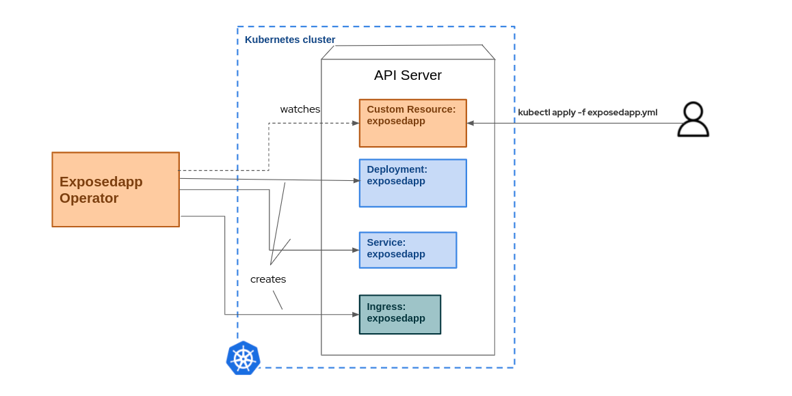

# ExposedApp Java Operator

This example shows how an operator can deploy a microservice application. To deploy this microservice in K8s, three Kubernetes resources are needed: the Deployment and an associated Service at the very least but also an Ingress if you intend to access the application from outside the cluster (or Route if the target cluster is OpenShift).
So what this project is an operator that will take ExposedApp custom resources and behind the scenes will create the K8s resources. Using this operator a dev team can create a CR in their namespace and move their application to a cloud destination.
The following diagram shows the architecture of this scenario:



Prerequisites:

- Kubernetes cluster running and connected to it. Use the infrastructure/setup-env.sh to setting it up using [Kind](https://kind.sigs.k8s.io/)
- Build a container image of a simple [Hello World Quarkus microservice application](https://github.com/aureamunoz/getting-started-on-quarkus-demo).
- Push the image to a public image registry.


1- Scaffold project
```shell
mkdir exposedapp
cd exposedapp
operator-sdk init --plugins quarkus --domain halkyon.io --project-name expose
```
```shell
~/demos/exposedapp$ tree
.
├── Makefile
├── pom.xml
├── PROJECT
└── src
    └── main
        ├── java
        └── resources
            └── application.properties

4 directories, 4 files

```

1.2- Show log:
```
No Reconciler implementation was found so the Operator was not started.
```

2- Defining a Custom Resource Definition and a controller: in terms of java this is creating a java class extending `CustomResource<ExposedAppSpec, ExposedAppStatus>` and a Reconciler class parametrized with the CR.

```shell
operator-sdk create api --version v1alpha1 --kind ExposedApp
```

```shell

tree
.
├── expose.iml
├── Makefile
├── pom.xml
├── PROJECT
├── src
│   └── main
│       ├── java
│       │   └── io
│       │       └── halkyon
│       │           ├── ExposedApp.java
│       │           ├── ExposedAppReconciler.java
│       │           ├── ExposedAppSpec.java
│       │           └── ExposedAppStatus.java
│       └── resources
│           └── application.properties

```
2.1- Show log:
```
2022-03-17 15:21:57,920 INFO  [io.qua.ope.dep.OperatorSDKProcessor] (build-12) Registered 'io.halkyon.ExposedApp' for reflection
2022-03-17 15:21:57,921 INFO  [io.qua.ope.dep.OperatorSDKProcessor] (build-12) Registered 'io.halkyon.ExposedAppSpec' for reflection
2022-03-17 15:21:57,921 INFO  [io.qua.ope.dep.OperatorSDKProcessor] (build-12) Registered 'io.halkyon.ExposedAppStatus' for reflection
2022-03-17 15:21:57,983 INFO  [io.qua.ope.dep.OperatorSDKProcessor] (build-12) Processed 'io.halkyon.ExposedAppReconciler' reconciler named 'exposedappreconciler' for 'exposedapps.halkyon.io' resource (version 'halkyon.io/v1alpha1')
```

3 - Set to true to automatically apply CRDs to the cluster when they get regenerated
```properties
quarkus.operator-sdk.crd.apply=true
```

3.1- Show log
```shell

2022-03-17 15:44:51,899 INFO  [io.qua.ope.run.OperatorProducer] (Quarkus Main Thread) Applied v1 CRD named 'exposedapps.halkyon.io' from /home/amunozhe/demos/exposedapp/target/kubernetes/exposedapps.halkyon.io-v1.yml
```

4- Replace the code of the `ExposedAppReconciler` with the following:

```java
package io.halkyon;

import io.fabric8.kubernetes.api.model.ObjectMeta;
import io.fabric8.kubernetes.api.model.ObjectMetaBuilder;
import io.fabric8.kubernetes.api.model.ServiceBuilder;
import io.fabric8.kubernetes.api.model.apps.DeploymentBuilder;
import io.fabric8.kubernetes.api.model.networking.v1.IngressBuilder;
import io.fabric8.kubernetes.client.KubernetesClient;
import io.javaoperatorsdk.operator.api.reconciler.Constants;
import io.javaoperatorsdk.operator.api.reconciler.Context;
import io.javaoperatorsdk.operator.api.reconciler.ControllerConfiguration;
import io.javaoperatorsdk.operator.api.reconciler.Reconciler;
import io.javaoperatorsdk.operator.api.reconciler.UpdateControl;

import java.util.HashMap;
import java.util.Map;

@ControllerConfiguration(namespaces = Constants.WATCH_CURRENT_NAMESPACE, name = "exposedapp")
public class ExposedAppReconciler implements Reconciler<ExposedApp> { 
  private final KubernetesClient client;

  public ExposedAppReconciler(KubernetesClient client) {
    this.client = client;
  }

  // TODO Fill in the rest of the reconciler

  @Override
  public UpdateControl<ExposedApp> reconcile(ExposedApp exposedApp, Context context) {
    // TODO: fill in logic for creating Deployment, Service and Ingress resources
    final var name=exposedApp.getMetadata().getName();
    final var spec=exposedApp.getSpec();
    final var imageRef=spec.getImageRef();
    final var labels = new HashMap<String, String>();
    labels.put("app.kubernetes.io/name","hello-quarkus");
    labels.put("app.kubernetes.io/version","1.0-SNAPSHOT");


    var deployment = new DeploymentBuilder()
            .withMetadata(createMetadata(exposedApp,labels))
            .withNewSpec()
              .withNewSelector().withMatchLabels(labels).endSelector()
              .withNewTemplate()
                .withNewMetadata().withLabels(labels).endMetadata()
                .withNewSpec()
                  .addNewContainer()
                  .withName(name).withImage(imageRef)
                    .addNewPort()
            .withName("http").withProtocol("TCP").withContainerPort(8080)
            .endPort()
            .endContainer()
            .endSpec()
            .endTemplate()
            .endSpec()
            .build();

    client.apps().deployments().createOrReplace(deployment);
    client.services().createOrReplace(new ServiceBuilder()
            .withMetadata(createMetadata(exposedApp,labels))
            .withNewSpec()
            .addNewPort()
            .withName("http")
            .withPort(8080)
            .withNewTargetPort().withIntVal(8080).endTargetPort()
            .endPort()
            .withSelector(labels)
            .withType("ClusterIP")
            .endSpec()
            .build());

    final var metadata = createMetadata(exposedApp, labels);
    metadata.setAnnotations(Map.of(
            "nginx.ingress.kubernetes.io/rewrite-target", "/",
            "kubernetes.io/ingress.class", "nginx"
    ));
    client.network().v1().ingresses().createOrReplace(new IngressBuilder()
            .withMetadata(metadata)
            .withNewSpec()
            .addNewRule()
            .withHost("hello-quarkus.127.0.0.1.nip.io")
            .withNewHttp()
            .addNewPath()
            .withPath("/")
            .withPathType("Prefix")
            .withNewBackend()
            .withNewService()
            .withName(metadata.getName())
            .withNewPort().withNumber(8080).endPort()
            .endService()
            .endBackend()
            .endPath()
            .endHttp()
            .endRule()
            .endSpec()
            .build());
    return UpdateControl.noUpdate();
  }

  private ObjectMeta createMetadata(ExposedApp resource, Map<String, String> labels){
    final var metadata=resource.getMetadata();
    return new ObjectMetaBuilder()
            .withName(metadata.getName())
            .addNewOwnerReference()
            .withUid(metadata.getUid())
            .withApiVersion(resource.getApiVersion())
            .withName(metadata.getName())
            .withKind(resource.getKind())
            .endOwnerReference()
            .withLabels(labels)
            .build();


  }


}
```

5- Replace the code of the ExposedAppSpec with the following:

```java
package io.halkyon;

public class ExposedAppSpec {

    // Add Spec information here
    private String imageRef;

    public String getImageRef() {
        return imageRef;
    }

    public void setImageRef(String imageRef) {
        this.imageRef = imageRef;
    }
}

```
6- Create a new file `exposedapp-CR.yaml` at the root of the project.

7 - Add the following content to the `exposedapp-CR.yaml` file. This represents a custom resource of type ExposedApp. Custom resources are to the Custom Resources Definition the same that objects are to the Java classes. 

```yaml
apiVersion: "halkyon.io/v1alpha1"
kind: ExposedApp
metadata:
  name: hello-quarkus
spec:
  imageRef: amunozhe/getting-started-jvm

```

8 - Apply the Custom Resource to the cluster by running the following command:
```shell
kubectl apply -f exposedapp-CR.yaml -n development
```

7 - Check that the microservice application have been deployed by checking the creation of K8s resources. You should have a Deployment, service and ingress

```shell
$ kubectl get pods,services,ingress -n development
NAME                                 READY   STATUS    RESTARTS   AGE
pod/hello-quarkus-57d8d9fb5c-46szf   1/1     Running   0          111m

NAME                    TYPE        CLUSTER-IP      EXTERNAL-IP   PORT(S)    AGE
service/hello-quarkus   ClusterIP   10.96.196.207   <none>        8080/TCP   111m

NAME                                      CLASS    HOSTS                            ADDRESS     PORTS   AGE
ingress.networking.k8s.io/hello-quarkus   <none>   hello-quarkus.127.0.0.1.nip.io   localhost   80      111m

```

8 - Finally you can access the application via the browser by navigating to https://hello-quarkus.127.0.0.1.nip.io/hello